# Advanced Lane Lines Detection

A demo of the pipeline (on both the project_video and challenge_video) can be found on [Youtube](https://www.youtube.com/watch?v=leUGLrnGym4)

[](https://www.youtube.com/watch?v=leUGLrnGym4)

## Project Overview

### 1.1 Goal
The goal of this project is to use traditional Computer Vision (i.e. non-machine learning) techniques to develop an advanced and robust algorithm that can detect and track lane boundaries in a video. The pipeline highlighted below was designed to operate under the following scenarios:

* It can detect *exactly* two lane lines, i.e. the left and right lane boundaries of the lane the vehicle is currently driving in.
* It cannot detect adjacent lane lines
* The vehicle must be within a lane and must be aligned along the direction of the lane
* If only one of two lane lines have been successfully detected, then the detection is considered invalid and will be discarded. In this case, the pipeline will instead output a lane line fit (for both left and right) based on the moving average of the previous detections. This is due to the lack of an implementation of the lane approximation function (which is considered as future work).

### 1.2 Dependencies

* Python 3.x
* NumPy
* Matplotlib (for charting and visualising images)
* OpenCV 3.x
* Pickle (for storing the camera calibration matrix and distortion coefficients)
* MoviePy (to process video files)

### 1.3 Project structure

* **lane_tracker.ipynb**: Jupyter notebook with a step-by-step walkthrough of the different components of the pipeline 
* **camera_cal/**: Folder containing a collection of chessboard images used for camera calibration and distortion correction
* **camera_calib.p**: Pickle file containing the saved camera calibration matrix and distortion coefficients
* **test_images/**: Folder containing a set of images for test purposes
* **gif_images/**:
* **readme_images**: Directory to store images used within this README.md
* **challenge_video.mp4**: Video containing uneven road surfaces and non-uniform lighting conditions
* **challenge_video_output.mp4**: Resulting output on passing the challenge_video through the pipeline
* **project_video.mp4**: Video with dark road surfaces and non-uniform lighting conditions
* **project_video_output.mp4**: Resulting output on passing the project_video through the pipeline

### 1.4 Usage

To use the pipeline:
* Run *Section 1* of the notebook titled *Camera Calibration and Distortion correction*. The code snippet here looks to load the *camera_calib.p* pickle file. If this is not found, then the calibration process is initiated using the chessboard images 
located under the *camera_cal/* folder

* Once the calibration process is complete, compile all the cells from *Section 2* through to *Section 9*.
* Finally, download the video to be processed, enter its path in the code snippet in *Section 9* along with the path for the output video and run this cell.

## 2. Pipeline

The various steps invovled in the pipeline are as follows, each of these has also been discussed in more detail in the sub sections below:

* Compute the camera calibration matrix and distortion coefficients given a set of chessboard images.
* Apply a distortion correction to raw images.
* Apply a perspective transform to rectify image ("birds-eye view").
* Use color transforms, gradients, etc., to create a thresholded binary image.
* Detect lane pixels and fit to find the lane boundary.
* Determine the curvature of the lane and vehicle position with respect to center.
* Warp the detected lane boundaries back onto the original image.
* Output visual display of the lane boundaries and numerical estimation of lane curvature and vehicle position.

### 2.1 Camera calibration and distortion correction

Distortion occurs when the camera maps/transforms the 3D object points to 2D image points. Since this transformation process is imperfect, the apparent shape/size/appearance of some of the objects in the image change i.e. they get distorted. Since we are trying to accurately place the car in the world, look at the curve of a lane and steer in the correct direction, we need to correct for this distortion. Otherwise, our measurements are going to be incorrect.

OpenCV provides three functions, namely, ```cv2.findChessboardCorners```, ```cv2.calibrateCamera``` and ```cv2.undistort```to do just that. Let's unpack this to see how it works:
* Firstly, we define a set of object points that represent inside corners in a set of chessboard images. We then map the object points to images points by using ```cv2.findChessboardCorners```.
* Secondly, we call ```cv2.calibrateCamera``` with this newly created list of object points and image poins to compute the camera calibration matrix and distortion coefficients. These are henceforth stored in a pickle file in the root directory for future use.
* Thirdly, we undistort raw images by passing them into ```cv2.undistort``` along with the two params calculated above.

This process has been visualised below for the reader.

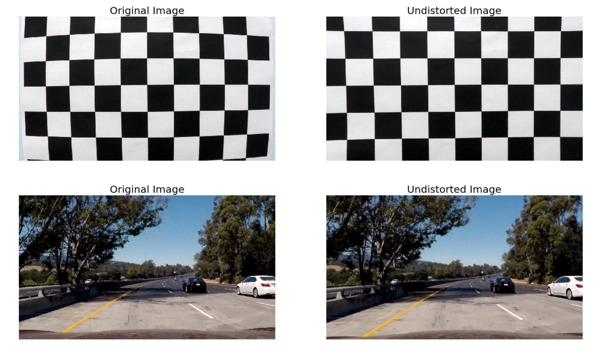

### 2.2 Perspective Transformation & ROI selection

Following the distortion correction, an undistorted image undergoes Perspective Transformation which warpes the image
into a *bird's eye view* scene. This makes it easier to detect the lane lines (since they are relatively parallel) and measure their curvature.

* Firstly, we compute the transformation matrix by passing the ```src``` and ```dst``` points into ```cv2.getPerspectiveTransform```. These points are determined empirically with the help of the suite of test images.
* Then, the undistorted image is warped by passing it into ```cv2.warpPerspective``` along with the transformation matrix
* Finally, we cut/crop out the sides of the image using a utility function ```get_roi()``` since this portion of the image contains no relevant information

An example of this has been showcased below for convenience.

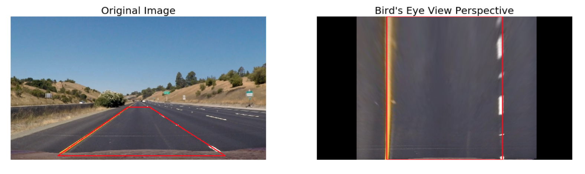
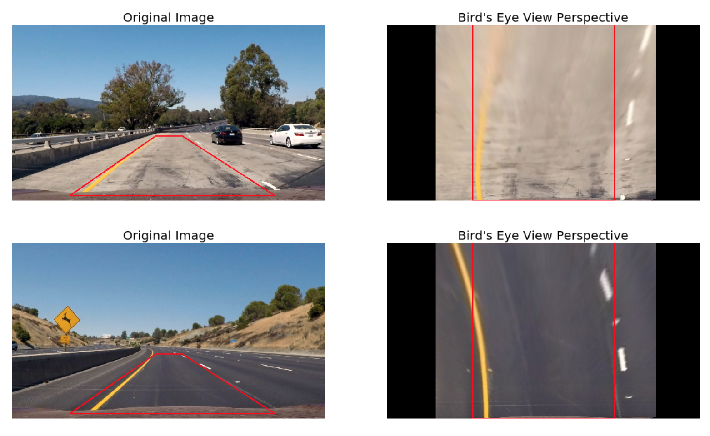

### 2.3 Generating a thresholded binary image

This was by far the most involved and challenging step of the pipeline. An overview of the test videos and a review of the [U.S. government specifications for highway curvature](http://onlinemanuals.txdot.gov/txdotmanuals/rdw/horizontal_alignment.htm#BGBHGEGC) revealed the following optical properties of lane lines (on US roads):

* Lane lines have one of two colours, white or yellow
* The surface on *both* sides of the lane lines has different brightness and/or saturation and a different hue than the line itself, and,
* Lane lines are not necessarily contiguous, so the algorithm needs to be able to identify individual line segments as belonging to the same lane line.  

The latter property is addressed in the next two subsections whereas this subsection leverages the former two properties to develop a *filtering process* that takes an undistorted warped image and generates a thresholded binary image that only highlights the pixels that are likely to be part of the lane lines. Moreover, the thresholding/masking process needs to be robust enough to account for **uneven road surfaces** and most importantly **non-uniform lighting conditions**.

Many techniques such as gradient thresholding, thresholding over individual colour channels of different color spaces and a combination of them were experimented with over a training set of images with the aim of best filtering the lane line pixels from other pixels. The experimentation yielded the following key insights:

1. The performance of indvidual color channels varied in detecting the two colors (white and yellow) with some transforms significantly outperforming the others in detecting one color but showcasing poor performance when employed for detecting the other. Out of all the channels of RGB, HLS, HSV and LAB color spaces that were experiemented with the below mentioned provided the greatest signal-to-noise ratio and robustness against varying lighting conditions:

    * *White pixel detection*: R-channel (RGB) and L-channel (HLS)
    * *Yellow pixel detection*: B-channel (LAB) and S-channel (HLS)

2. Owing to the uneven road surfaces and non-uniform lighting conditions a **strong** need for **Adaptive Thresholding** was realised

3. Gradient thresholding didn't provide any performance improvements over the color thresholding methods employed above, and hence, it was not used in the pipeline

The final solution used in the pipeline consisted of an **ensemble of threshold masks**. Some of the key callout points are:
* Five masks were used, namely, RGB, HLS, HSV, LAB and a custom adaptive mask
* Each of these masks were composed through a *Logical OR* of two sub-masks created to detect the two lane line colors of yellow and white. Moreover, the threshold values associated with each sub-mask was adaptive to the mean of image / search window (further details on the search window has been provided in the sub-sections below)

   Logically, this can explained as: ```Mask  = Sub-mask (white)  | Sub-mask (yellow)```

   The code snippet provided below highlights the steps involved in the creation of one of the masks from the ensemble

   ```
   ### HLS color space
       hls = cv2.cvtColor(img, cv2.COLOR_RGB2HLS)
       L = hls[:,:,1]
       L_max, L_mean = np.max(L), np.mean(L)
       S = hls[:,:,2]
       S_max, S_mean = np.max(S), np.mean(S)

       # YELLOW
       L_adapt_yellow = max(80, int(L_mean * 1.25))
       S_adapt_yellow = max(int(S_max * 0.25), int(S_mean * 1.75))
       hls_low_yellow = np.array((15, L_adapt_yellow, S_adapt_yellow))
       hls_high_yellow = np.array((30, 255, 255))

       hls_yellow = binary_threshold(hls, hls_low_yellow, hls_high_yellow)

       # WHITE
       L_adapt_white =  max(160, int(L_max *0.8),int(L_mean * 1.25))
       hls_low_white = np.array((0, L_adapt_white,  0))
       hls_high_white = np.array((255, 255, 255))

       hls_white = binary_threshold(hls, hls_low_white, hls_high_white)

       hls_binary = hls_yellow | hls_white
   ```

* The *custom adaptive mask* used in the ensemble leveraged the OpenCV ```cv2.adaptiveThreshold``` API with a Gaussian kernel for computing the threshold value. The construction process for the mask was similar to that detailed above with one important mention to the constructuion of the submasks:
    * White submask was created through a Logical AND of RGB R-channel and HSV V-channel, and, 
    * Yellow submask was created through a Logical AND of LAB B-channel and HLS S-channel

The image below showcases the masking operation and the resulting thresholded binary image from the ensemble for two test images.

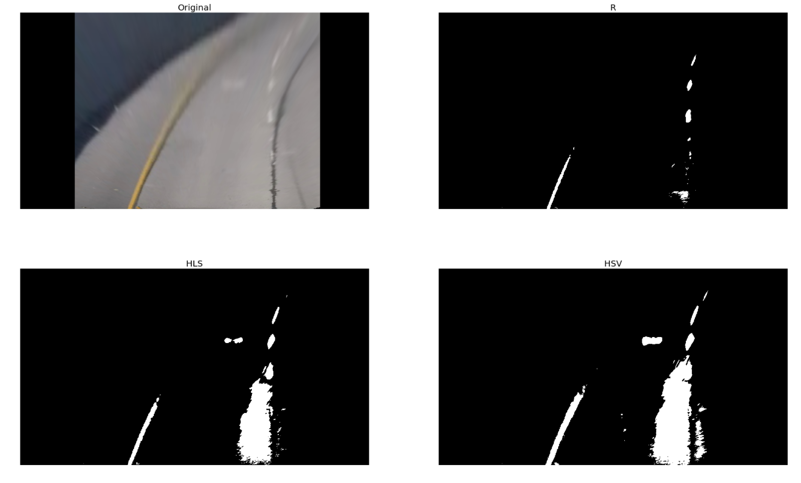
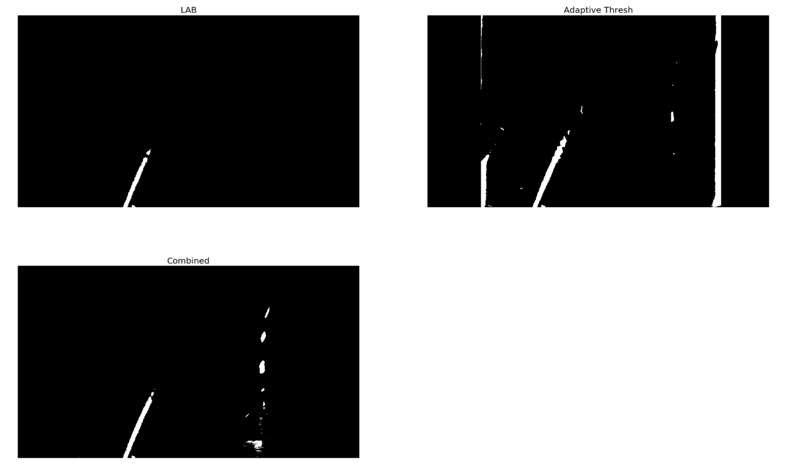
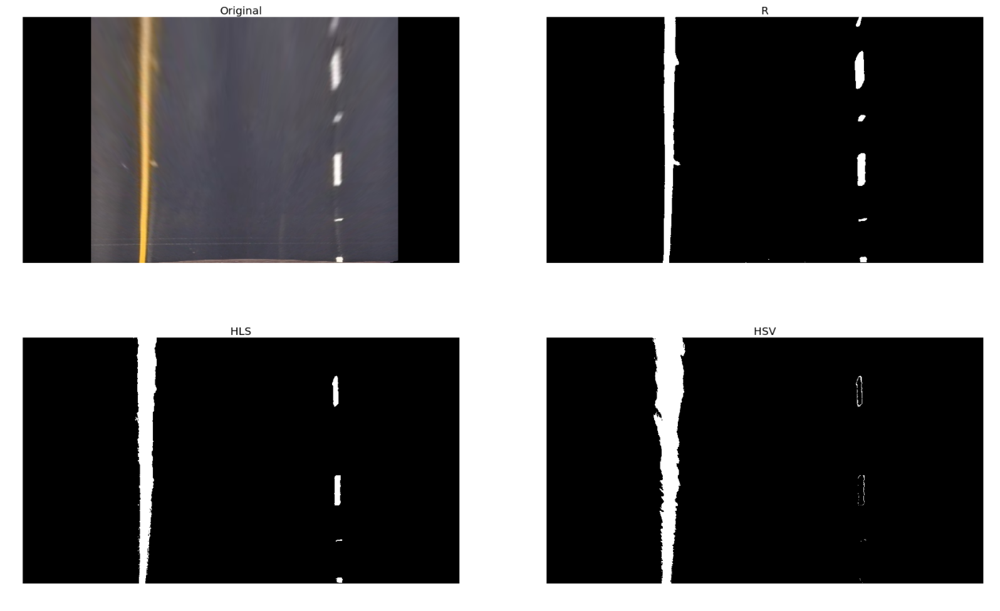
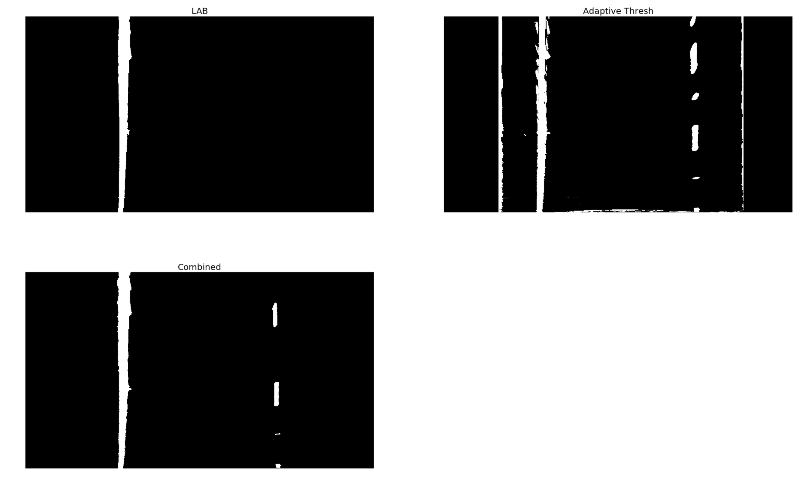

An important mention to the reader is that the use of the ensemble gave a **~15% improvement** in pixel detection
over using just an individual color mask. 

### 2.4 Lane Line detection: Sliding Window technique

We now have a *warped, thresholded binary image* where the pixels are either 0 or 1; 0 (black color) constitutes the unfiltered pixels and 1 (white color) represents the filtered pixels. The next step involves mapping out the lane lines and  determining explicitly which pixels are part of the lines and which belong to the left line and which belong to the right line.

The first technique employed to do so is: **Peaks in Histogram & Sliding Windows**

1. We first take a histogram along all the columns in the lower half of the image. This involves adding up the pixel values along each column in the image. The two most prominent peaks in this histogram will be good indicators of the x-position of the base of the lane lines. These are used as starting points for our search. 

2. From these starting points, we use a sliding window, placed around the line centers, to find and follow the lines up to the top of the frame.

The parameters used for the sliding window search are:
```
   nb_windows = 12 # number of sliding windows
   margin = 100 # width of the windows +/- margin
   minpix = 50 # min number of pixels needed to recenter the window
   min_lane_pts = 10  # min number of 'hot' pixels needed to fit a 2nd order polynomial as a lane line
```

The *'hot' pixels* that we have found are then fit to a second order polynomial. The reader should note that we are fitting for ```y``` as opposed to ```x``` since the lines in the warped image are near vertical and may have the same x value for more than one y value. Once we have computed the 2nd order polynomial coefficients, the line data is obtained for y ranging from (0, 720 i.e. image height) by using the mathematical formula: 

```x = f(y) = Ay^2 + By + C```

A visualisation of this process can be seen below.

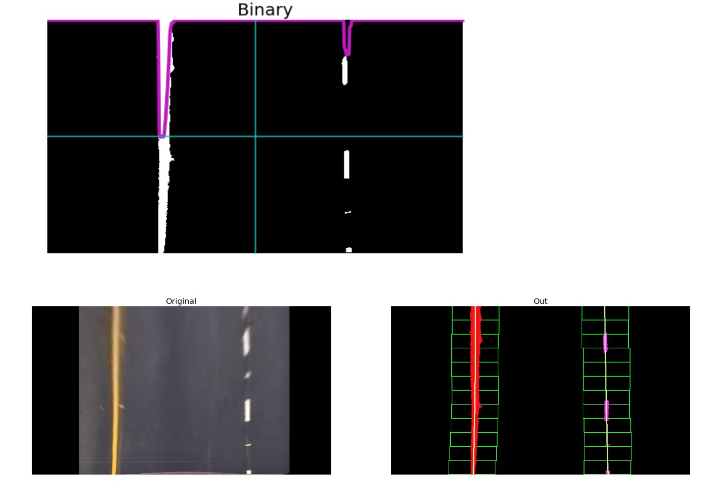
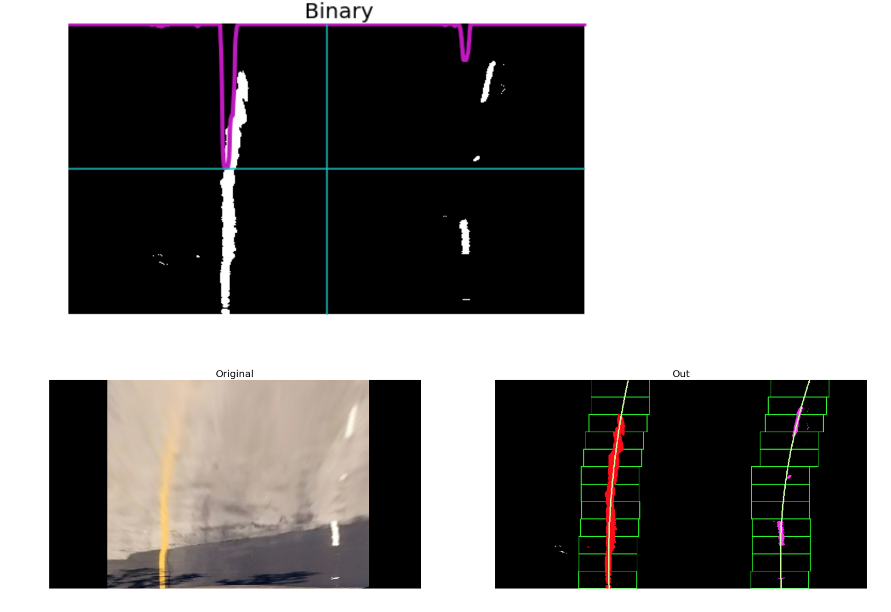

Here, the red and pink color represents the 'hot' pixels for the left and right lane lines respectively. Furthermore, the line in green is the polyfit for the corresponding 'hot' pixels.

### 2.5 Lane Line detection: Adaptive Search

Once we have successfully detected the two lane lines, for subsequent frames in a video, we search in a margin around the previous line position instead of performing a blind search.

Although the Peaks in Histogram and Sliding Windows technique does a reasonable job in detecting the lane line, it often fails when subject to non-uniform lighting conditions and discolouration. To combat this, a method that could perform adaptive thresholding over a **smaller** receptive field/window of the image was needed. The reasoning behind this approach was that performing adaptive thresholding over a smaller kernel would more effectively filter out our 'hot' pixels in varied conditions as opposed to trying to optimise a threshold value for the entire image.

Hence, a custom *Adaptive Search technique* was implemented to operate once a frame was successfully analysed and a pair of lane lines were polyfit through the Sliding Windows technique. This method:

1. Follows along the trajectory of the previous polyfit lines and splits the image into a number of smaller windows.
2. These windows are then iteratively passed into the ```get_binary_image``` function (defined in Step 4 of the pipeline) and their threshold values are computed as the mean of the pixel intensity values across the window
3. Following this iterative thresholding process, the returned binary windows are stacked together to get a single large binary image with dimensions same as that of the input image

An important pre-requisite for this method is that: the polynomial coefficients from the previous frame must be known. Therefore, after each successful detection the correpsonding polynomial coefficient are stored into a global cache, the size for which is defined by the user. Moreover, this cache is also used to reduce the jitter and smooth the poly-curve from one frame to the next.

The parameters used in this method are:

```
   nb_windows = 10 # Number of windows over which to perform the localised color thresholding  
   bin_margin = 80 # Width of the windows +/- margin for localised thresholding
   margin = 60 # Width around previous line positions +/- margin around which to search for the new lines
   smoothing_window = 5 # Number of frames over which to compute the Moving Average
   min_lane_pts = 10  # min number of 'hot' pixels needed to fit a 2nd order polynomial as a lane line
```

A visualisation of this process has been showcased below.

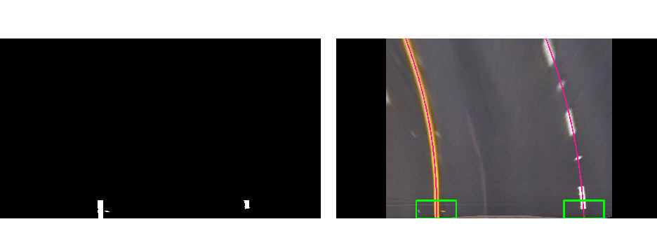

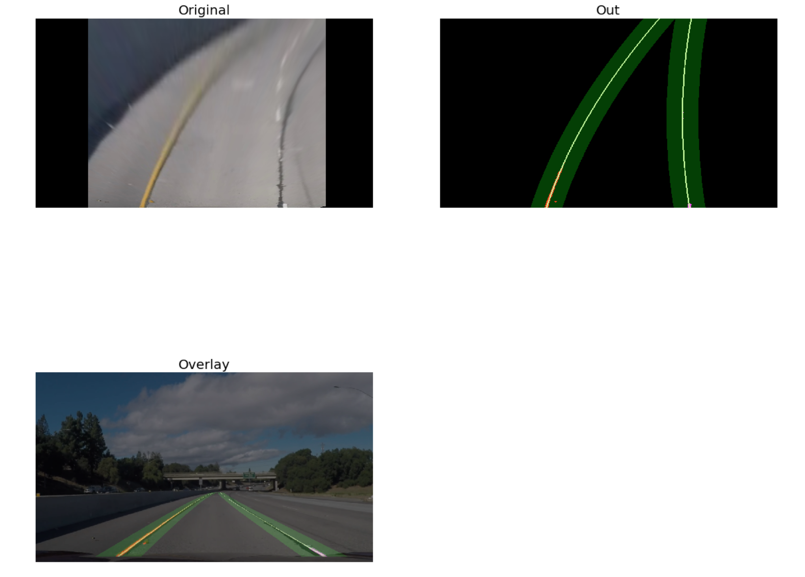
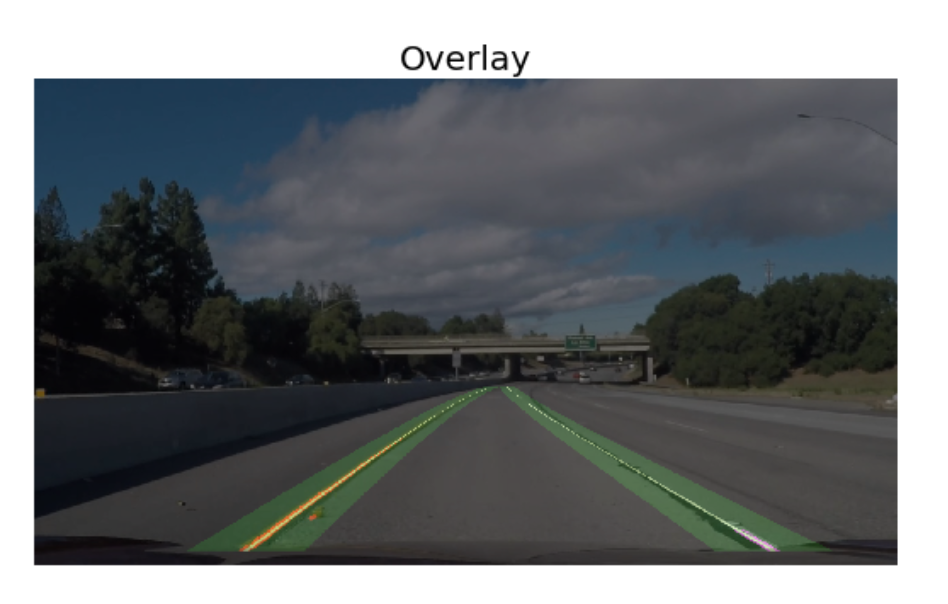

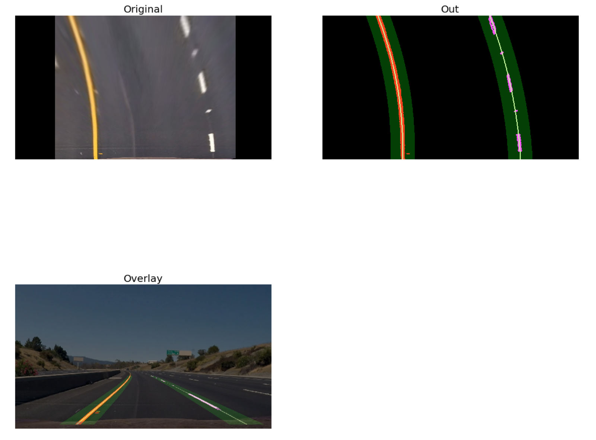
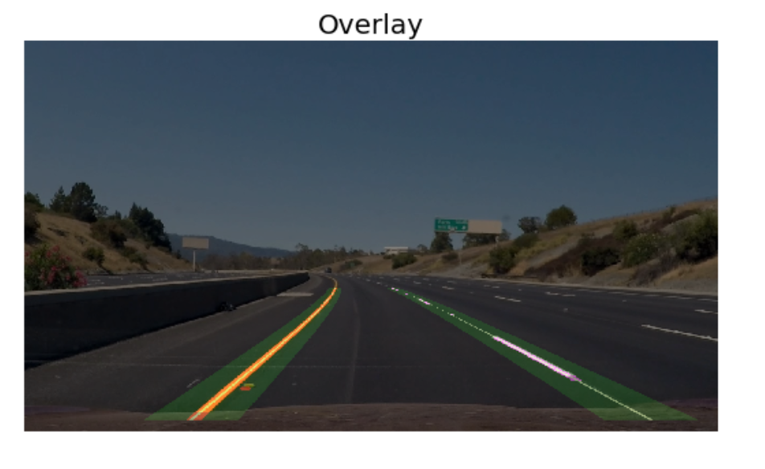

### 2.6 Conversion from pixel space to real world space

To report the lane line curvature in metres we first need to convert from pixel space to real world space. For this, we measure the width of a section of lane that we're projecting in our warped image and the length of a dashed line. Once measured, we compare our results with the U.S. regulations (as highlighted [here](http://onlinemanuals.txdot.gov/txdotmanuals/rdw/horizontal_alignment.htm#BGBHGEGC)) that require a minimum lane width of 12 feet or 3.7 meters, and the dashed lane lines length of 3.048 meters.

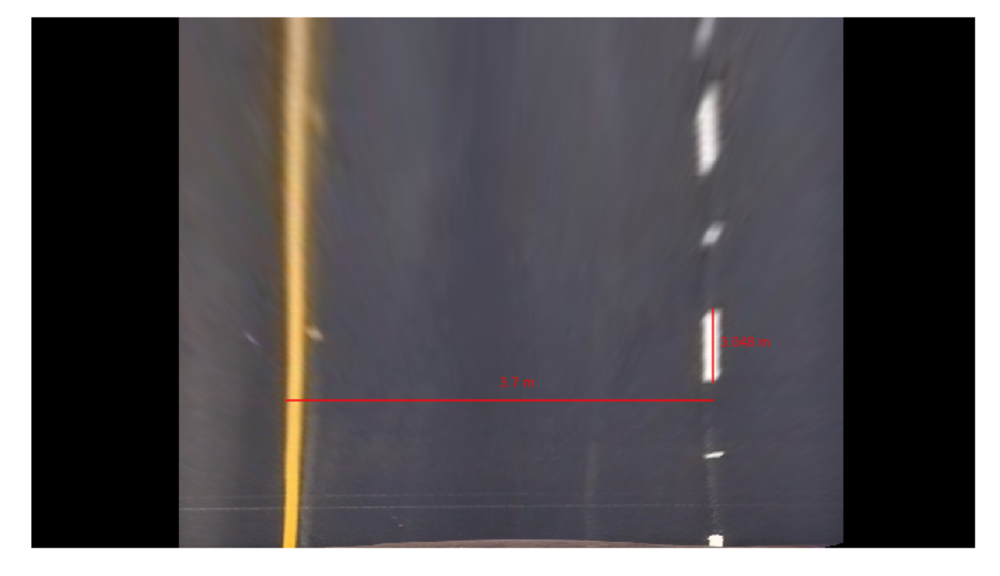

The values for metres/pixel along the x/y direction are therefore:

```
Average meter/px along x-axis: 0.0065
Average meter/px along y-axis: 0.0291
```

### 2.7 Curvature and Offset

Following this conversion, we can now compute the radius of curvature (see tutorial [here](https://www.intmath.com/applications-differentiation/8-radius-curvature.php)) at any point x on the lane line represented by the function ```x = f(y)``` as follows:

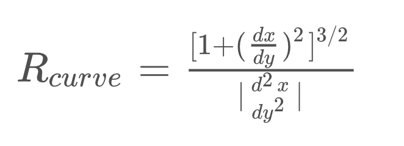

In the case of the second order polynomial above, the first and second derivatives are:

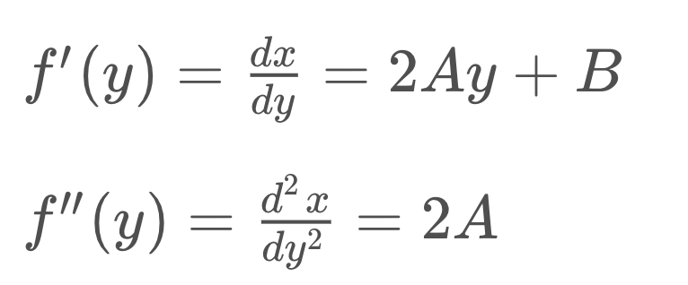

So, our equation for radius of curvature becomes:

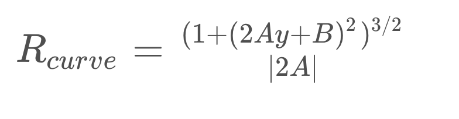

Note: since the y-values for an image increases from top to bottom, we compute the lane line curvature at ```y = img.shape[0]```, which is the point closest to the vehicle.

A visualisation for this step can be seen below.

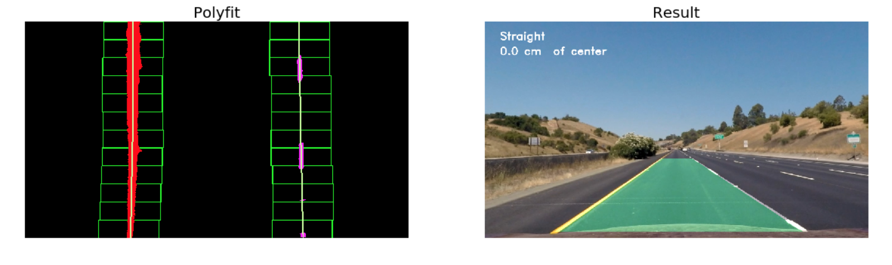
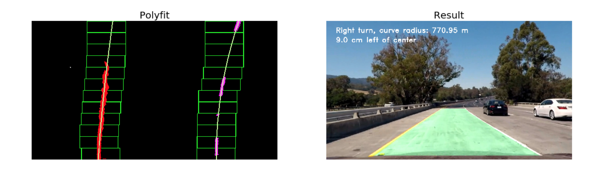


### 2.8 Pipeline

An image processing pipeline is therefore setup that runs the steps detailed above in sequence to process a video frame by frame. The results of the pipeline on two test videos can be visualised in the ```project_video_output.mp4``` and ```challenge_video_output.mp4```

An example of a processed frame has been presented to the reader below.

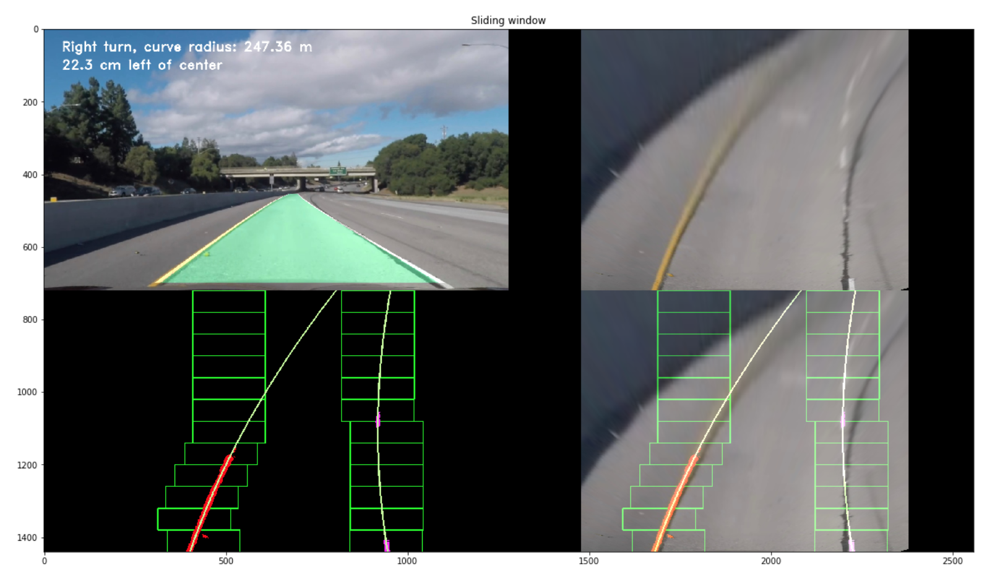

## 3. Reflection and Future Work

This was a very tedious project which involved the tuning of several parameters by hand. With the traditional Computer Vision approach I was able to develop a strong intuition for what worked and why. I also learnt that the solutions developed through such approaches aren't very optimised and can be sensistive to the chosen parameters. As a result, I developed a strong appreciation for Deep Learning based approaches to Computer Vision. Although, they can appear as a black box at times Deep learning approaches avoid the need for fine-tuning these parameters, and are inherently more robust. 

The challenges I encountered were almost exclusively due to non-uniform lighting conditions, shadows, discoloration and uneven road surfaces. Although, it wasn't difficult to select the thresholding parameters to successfully filter the lane pixels it was very time consuming. Furthermore, the two biggest problem with my pipeline that become evident in the harder challenge video are:

1. Its inability to handle sharp turns and constantly changing slope of the road. This a direct consequence of the assumption made in Step 2 of the pipeline where the road in front of the vehicle is assumed to be relatively flat and straight(ish). This results in a 'static' perspective transformation matrix meaning that if the assumption doesn't hold true the lane lines will no longer be relatively parallel. As a result, it becomes a lot harder to assess the validity of the detected lane lines, because even if the lane lines in the warped image are not nearly parallel, they might still be valid lane lines. 

2. Poor lane lines detection in areas of glare/ severe shadows / combination of both. This results from the failure of the thresholding function to successfully filter out the lane pixels in these extreme lighting conditions

In the coming weeks, I aim to tackle these problems and improve the performance of the model on the harder challenge video.
