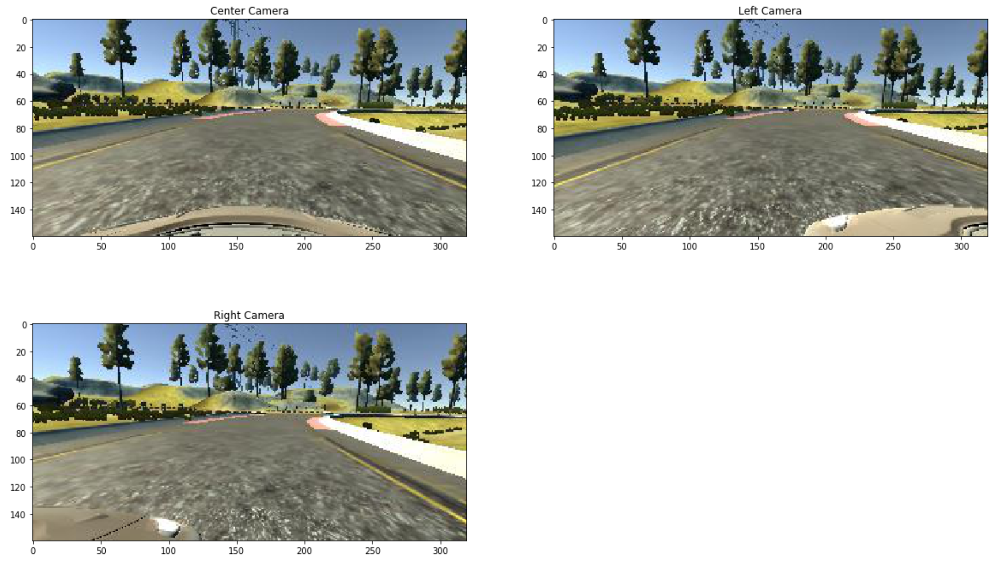
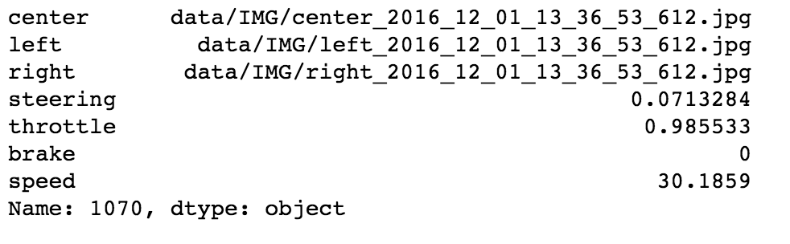
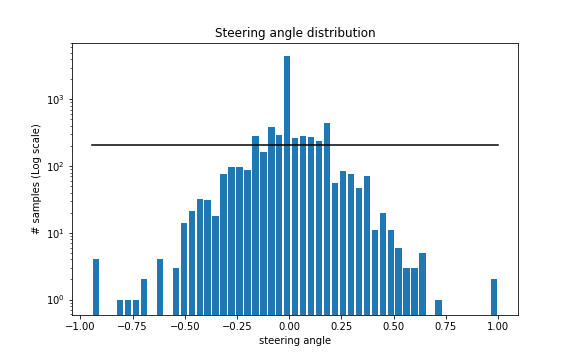
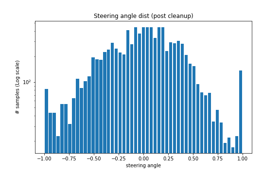
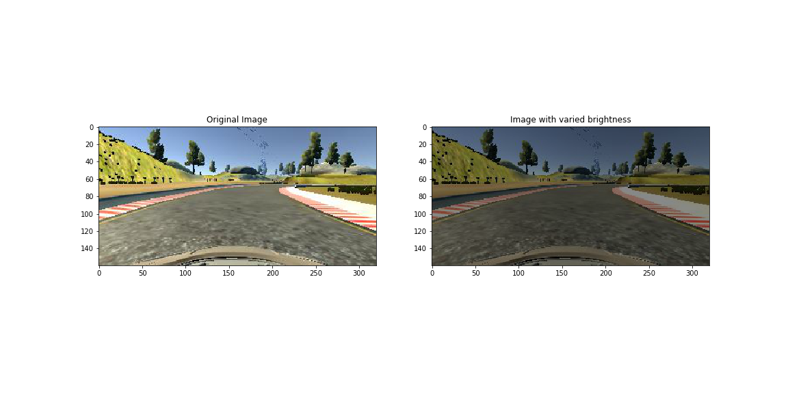
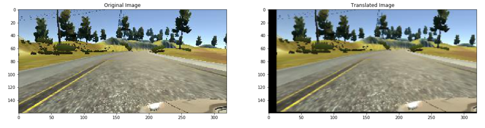
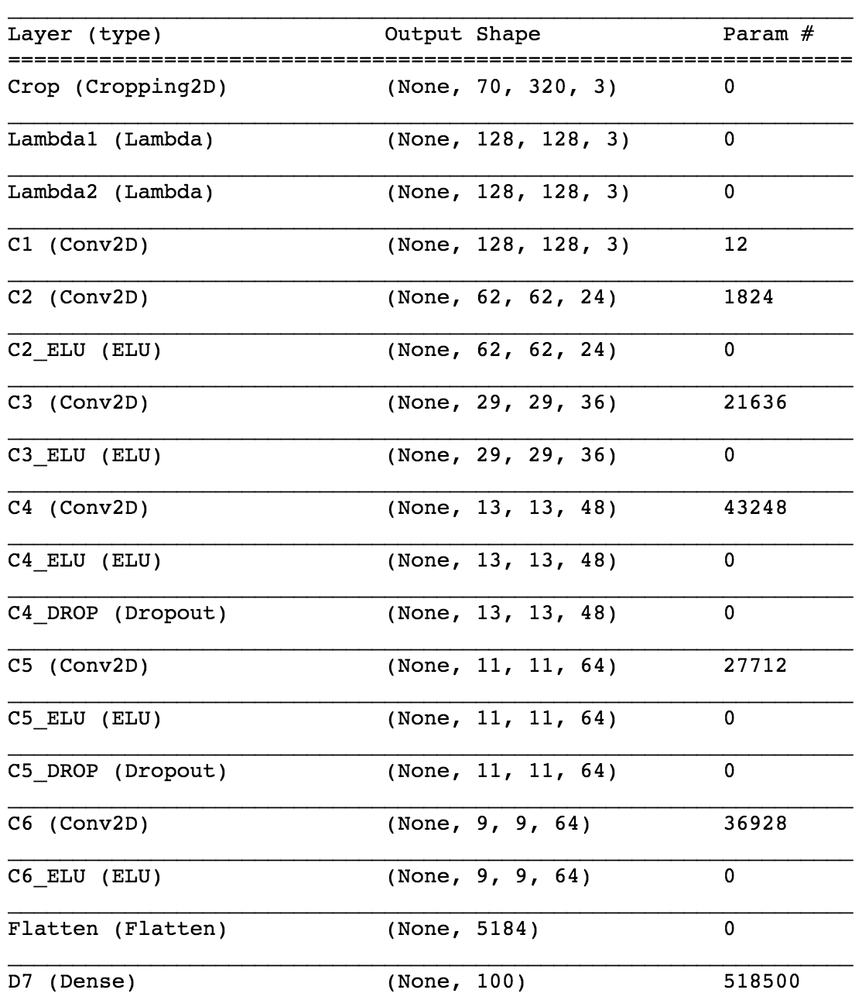
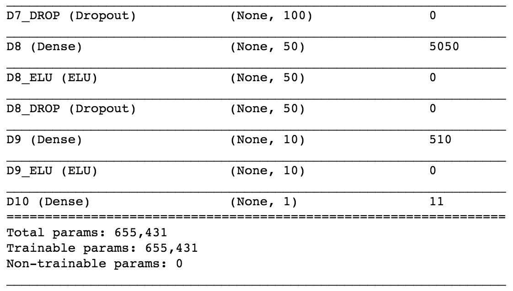
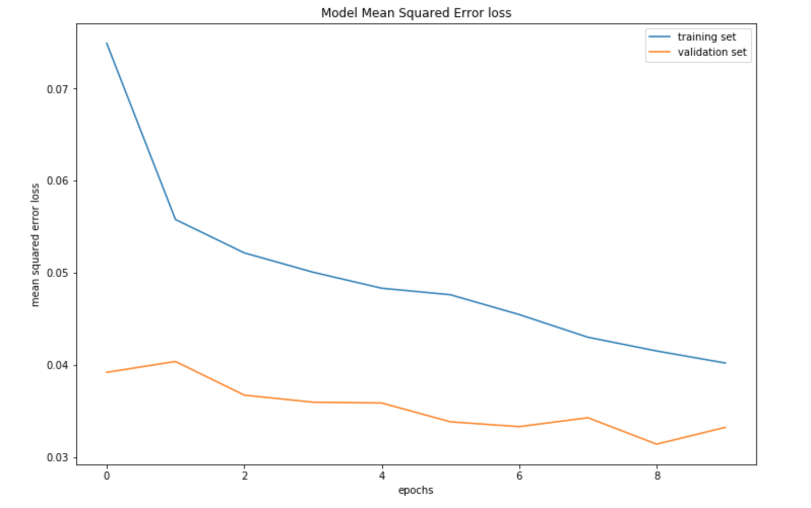
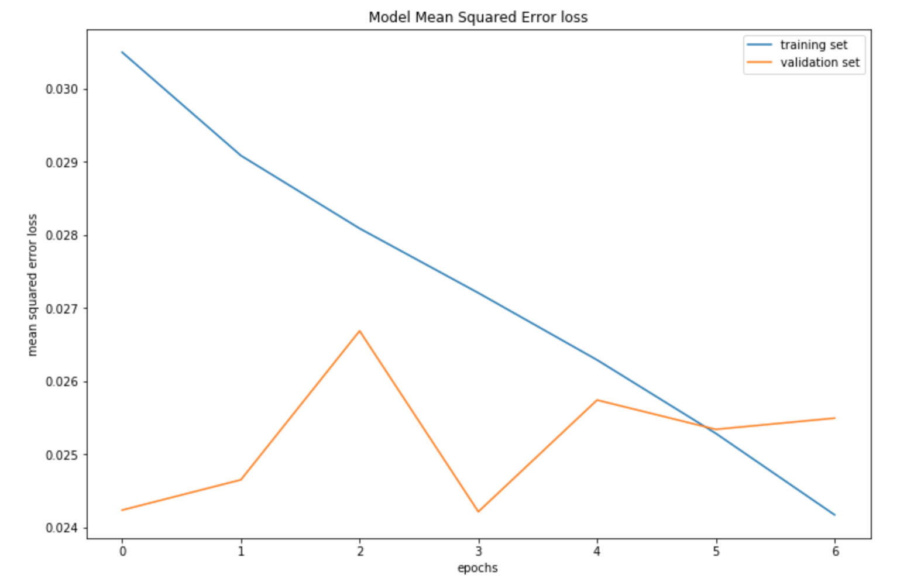

# Behavioural Cloning

TODO: add link to youtube video

## 1. Project Overview

### 1.1 Goal
The goal of the Behavioural Cloning project was to:
* Develop an end-to-end Deep Learning solution for self-driving cars in a simulated environment.
* The motivation behind this approach is that the system automatically learns internal representations of the processes required to parse an input of the environment in the form of an image from a front facing camera and output a steering angle in response. This approach is inspired from the work done by [NVIDIA] where there was no explicit decomposition of the problem, such as lane line detection, path planning and control. The end-to-end system optimizes all the processing steps simultaneously.
* Succesfully complete atleast one lap of Track 1
* Evaulate the model performance on Track 2 (alot harder due to varying light conditions and sharp turns)

### 1.2 Approach
To complete the project, the following was done:
1. Literary research:
  * [NVIDIA]'s End to End Learning for Self-Driving Cars
  * Udacity course material
2. Leveraged the Udacity simulator to collect training data
3. Built a 10-layer Convolutional Neural Network that takes in an input image of shape (160, 320, 3) and outputs a steeing angle
4. Trained and validated the model using a training set and validation set
5. Evaluated the performance of the model on Track 1 & Track 2
6. Collected additional training data for critical scenes, tweaked the data pipeline and network architecture
8. Repeated the process from step 5 onwards until the model could succesfully drive the car on both Track 1 and Track 2

### 1.3 Dependencies
* Keras 2
* Tensorflow
* OpenCV 3.0+
* NumPy
* Matplotlib
* Pandas
* Udacity simulator

### 1.4 Project Structure
* *model.ipynb*: Jupyter notebook containing the DL pipeline 
* *model.html*: HTML version of the above notebook
* *drive.py*: Script to connect to the simulator and for driving the car in autonomous mode 
* *model.h5*: Final Keras model
* examples: Collection of images for visualisation in the README.md
* README.md: Project writeup

### 1.5 Usage
To run the model,
* Fire up the Udacity simulator, and then,
* From the command line run ```python drive.py model.h5```

## 2. Dataset acquisition, exploration, cleanup and augmentation

### 2.1 Acquisition
A quick toy with the simulator highlighed that:
* Track 1 is counter clock-wise with majority of the stretches straight and turns being mostly left. This would result in an unbalanced and left turn biased model. Moreover, in stark contrast, 
* Track 2 consisted of alot of sharp turns coupled with steep ups and down. Furthermore, the lighting conditions also varied throughout the track.

Therefore, we would need a model that could generalise well to both tracks!

To avoid an unbalanced biased dataset, samples were collected from both tracks. 
For Track 1, **8038 samples** were collected. This consisted of one lap in the counter clockwise direction (mostly left turns), a lap in the clockwise direction (mostly right turns) and samples associated to critical scenes (e.g. sharp bends and road with tarmac and dirt on either side, etc.)
Meanwhile, for Track 2, **9454 samples** were collected in a similar fashion as above.

Note: each **sample** consisted of the corresponding scene being captured in three different perspectives. This was achieved through the use of center, left and right front facing cameras. Additionally, the steering angle (for only the center camera), throttle, brake and speed of the car were also captured in association with each sample.

Example of a sample has been visualised below.

 

### 2.2 Data exploratory visualisation

Following the initial data acquisition phase, different methods were employed to derive some insights from the data.

Firstly, a *log-scale distribution* of the steering angles was plotted on a bar chart to gain an understanding into the distribution of the samples. This has been presented to the reader below.



As can be observed, majority of the samples fell into the bin associated with driving on a straight stretch of road. This is inline with the conclusion derived above about the dataset being unbalanced and uneven.

### 2.3 Cleanup
To balance out the data set, all the bins that contained samples above a user defined threshold were reduced by randomly deleting the excess number of samples. The threshold for this project was taken to be 1.4 times the mean samples across the bins. This has been demarcated by the black line in the graph above.

Following the cleanup process, the distribution looked as follows:



and contained an overall **9438 samples**

### 2.4 Data Augmentation
In order to further diversify (and balance) the data set, different augmentation techniques were employed.

For the training set, I:
* Utilised camera images from *all three perspectives* (center/left/right) for each sample. The left and right images were used to simulate the car being off the center and to also *simulate recovery*. Understandably, a **correction factor** for this added. 

  This was a hyper param whose final value was set to **0.175** following a process of random search. 

  For the left image, ```steering_angle += correction``` the correction factor was added to the steering angle of a sample to encourage a slight adjustment to the right to reach the center. 

  Similarly, for the right image, ```steering_angle -= correction``` the correction factor was negated from the steering angle to encourage an adjustment to the left to reach the center.

* For each perspective in a sample, I used the:
  * original image
  * flipped version, and,
  * another augmented image which was generated by a function that took in the original/flipped image with a 50% probability and applied brightness augmentation or translation or both based on a 33% probability.

* As a result, we generated 9 images/sample thereby taking our total number of images in the training set to ```int(9438 samples * 0.8 (training set split)) * 9 = 67,950 images```

For the validation set, no data augmentation was done over the images.

Each of the augmentation techniques have been detailed below.

* **Brightness augmentation**: The motivation stems from being able to create images that could replicate day, night and varied lighting conditions that one would encounter while driving. This was achieved by converting the original image from RGB space to HSV space, varying the brightness channel (V) and then converting the image back to RGB. An application of this on an image has been displayed below for convenience.



* **Translation**: The camera images were translated *horizontally* to simulate the effects of the car being at different positions in the lane and *vertically* to simulate the car being up or down a slope.



* **Flipping**: The image was flipped using NumPy's ```np.fliplr(image)``` and the corresponding steering angle was reversed as well.


Note: for more clarity, please read the ```generator()``` function in the model.ipynb Jupyter notebook.

## 3. Model

### 3.1 Architecture

I used [NVIDIA]'s CNN architecture as a starting point since it was very powerful and had already been empirically tested for a similar task. The model proved more than adept and ended up being my final architecture. However, I made some slight adjustments/tweaks to the network to better suit my purpose. Here is a visualisation of my final network:




As can be observed above, my modifications include:
* **Cropping** layer to crop off the top 70 pixels and bottom 20 pixels since these regions have no critical information that needs to be learned
* Lambda layer for **resizing** the image from (70,320,3) -> (128, 128, 3). This was done to reduce the overall memory and computational requirements.
```
128x128x3 = 49,152 pixels < 70x320x2 = 67,200 pixels
```
* Lambda layer for **normalisation** and **mean centering**. This makes sure that all the features lie in the interval of [-1, 1]
* **ELU** layer for non-linearity, and,
* **Dropout** layer with keep probability of 0.7 to prevent overfitting

Note: all the pre-processing (i.e. cropping, resizing, normalisation and mean centering) was done via Keras Layers to *parallelise* this task for the batch images via the GPU!

### 3.2 Batch Generator
Given that the size of the original image was 160 x 320 x 3 pixels, storing 67,953 images would take over 10 GB. That's a lot of memory! Not to mention that preprocessing data can change data types from an int to a float, which would increase the size of the data by a factor of 4. In order to be able to work with such large amounts of data within the tight memory constraints Python Generators were used with Keras' ```fit_generator()``` function.

Also, given the use of left and right camera images, and additional augmented images for the training process, the true batch size for the generator varied in stark contrast to the desired batch size. This was calculated as follows:

```
def get_generator_true_batch_size(desired_batch_size, nb_perspectives, nb_augs_per_image):
    transformations_per_image = 2 + nb_augs_per_image # 2 represents the original + flipped image
    images_per_sample = nb_perspectives * transformations_per_image
    return math.ceil(desired_batch_size / images_per_sample), images_per_sample
```

### 3.3 Hyper parameters
The following hyper params were chosen for the model after random search:
* Adam Optimiser with learning rate of 0.0005
* Batch size of 32 (however, the true batch size was different from the desired batch size as already explained in the section 'Batch Generator' above)
* Alpha = 0.1 for the ELU activation layer
* Keep probability = 0.7 for the Dropout layer
* Steering correction of 0.175 for the left and right camera images
* The model was trained over 10 Epochs but the Keras *Early Stopping* callback was implemented to end the training process if the validation accuracy plateaued for more than 3 epochs. Moreover, the *Model Checkpoint* was also instantiated to save the model after every epoch.

### 3.4 Training and Evaluation 
For the first training run, all three camera images in a sample were utilised from the 9483 samples obtained from cleaning and spliting the dataset. These images were then flipped and supplemented with 1 augmented image per perspective. Hence, all in all 67,950 images were used for training. The figure below shows the learning curves for the training and validation loss.



After this initial training run, the top four models with lowest validation losses were chosen and their performance was evaluated in the simulator. The model that performed the best from the ensemble was selected and trained for a second time over all the samples. This time the training was done without the left/right and augmented images, only flipped images were used. 

The reasoning behind this approach is that it's always good to have a vast diverse data to learn a general understanding of how to drive. However, in order achieve the last few percentage's of validation accuracy, using *pure/true data* is more crucial. This is because the steering angle correction applied to the left and right camera images was a hyperparam, i.e. a guessed value. It wasn't thoroughly optimised or proven to be correct. As a result, it would always introduce a certain degree of error. This could prove detrimental in critical scene's like sharp turns in Track 2 where a slight offset could roll the car off the track and into a valley.

The learning curves for this second training run have been visualised below.



Furthermore, an additional observation made here was that the model with the lowest validation accuracy didn't always perform the best. In my case, the model with the second best validation accuracy gave the smoothest drive on the track. This was attributed to where and how the errors in the model surfaced themselves on the track. If most/all of the poor steering decisions were made on a critical scene, this would significantly impact either the driving experience or in a worse case cause the car to drift off track.

## 4. Results
The final outcome is that the car is able to autonomously drive around both the tracks without leaving the road. 

Yay! 

This can be visualised on [Youtube].

## 5. Future work
* Evalaute the performance on other tracks and determine how well the model generalises
* Try additional image augmentation techniques like - occlusion, adding obstacles (e.g. other cars) to the image, etc.

[//]: # (References)

[Nvidia]: http://images.nvidia.com/content/tegra/automotive/images/2016/solutions/pdf/end-to-end-dl-using-px.pdf "Nvidia"
[Youtube]: "Youtube"
