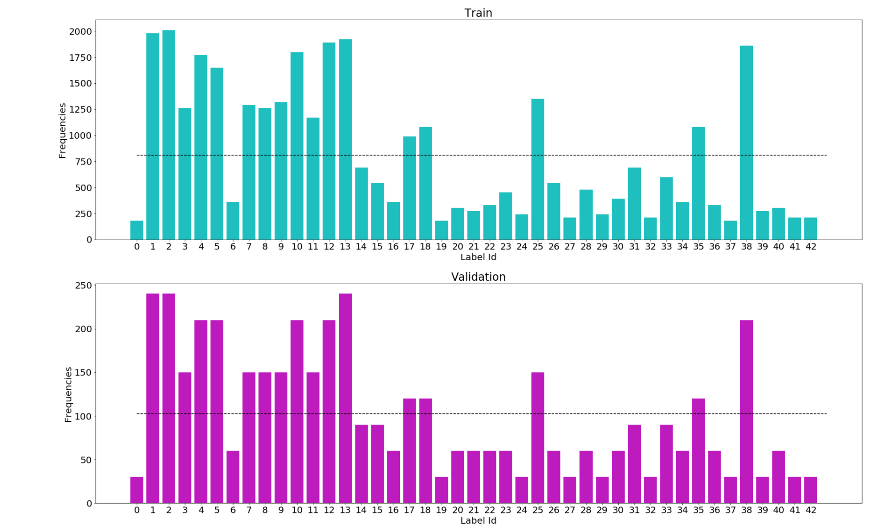

# Traffic Sign Recognition 

[//]: # (Image References)

[image1]: ./examples/visualization.jpg "Visualization"
[image2]: ./examples/grayscale.jpg "Grayscaling"
[image3]: ./examples/random_noise.jpg "Random Noise"
[image4]: ./examples/placeholder.png "Traffic Sign 1"
[image5]: ./examples/placeholder.png "Traffic Sign 2"
[image6]: ./examples/placeholder.png "Traffic Sign 3"
[image7]: ./examples/placeholder.png "Traffic Sign 4"
[image8]: ./examples/placeholder.png "Traffic Sign 5"

## Introduction

In this project, I developed a model using a Convolutional Neural Network (CNN) to classify traffic signs. The model was trained and validated using images from the [German Traffic Sign Dataset](http://benchmark.ini.rub.de/). After the model was trained, it's performance was evaulated on random traffic sign images found on the web.

My final model results are as follows:
* Training set accuracy of 99.90%
* Validation set accuracy of  98.84% 
* Test set accuracy of 97.29%
* New Test set accuracy of 100% (6 new images)

The steps undertaken in this project are as follows:
* Load the data set 
* Explore, summarize and visualize the data set
* Design, train and test a model architecture
* Use the model to make predictions on new images
* Analyze the softmax probabilities of the new images

## Data Set Summary & Exploration

### 1. Basic summary of the data set 

I used the NumPy library to calculate summary statistics of the traffic signs data set:

* The size of original training set is 34799
* The size of the validation set is 4410 
* The size of test set is 12630
* The shape of a traffic sign image is 32x32x3 represented as integer values (0-255) in the RGB color space
* The number of unique classes/labels in the data set is 43

### 2. Exploratory visualization of the dataset

Following the data set summarisation, I performed exploratory visualizations of the data set. This included:

* Plotting an image for each label from the training set. Some of these have been displayed below for convenience.

* Ploting bar charts to see the image distribution across the training & validation sets.

We notice that the distribution in training set *is not balanced*. We have some classes with less than 300 examples and other well represented with more than 1000 examples. A similar story is observed in the validation set distribution as showcased above.

## Future work

In order to *improve the performance* of my model I would perform the following:
* Leverage model ensembles
* Consider ways to do a more detailed analysis of model performance by looking at predictions in more detail. For example, calculate the precision and recall for each traffic sign type from the test set and then compare performance on these five new 
images.
* Create a deeper network akin to AlexNet by stacking more conv layers prior to each pooling operation.
* Utilise global average pooling to get reduce the number of FC layers and therefore the overall number of params across the network
* Alternatively, I would like to leverage Transfer Learning by using exiting CNN architectures to classify the traffic sign images. In particular, I would like to use ResNet/GoogleNet/VGGNet.
