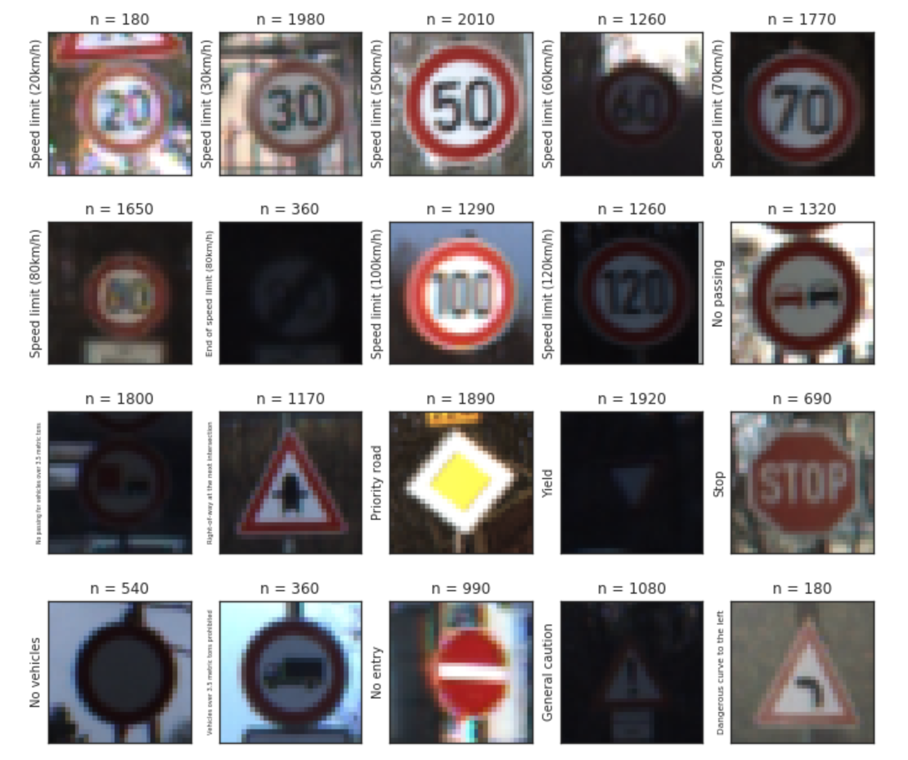
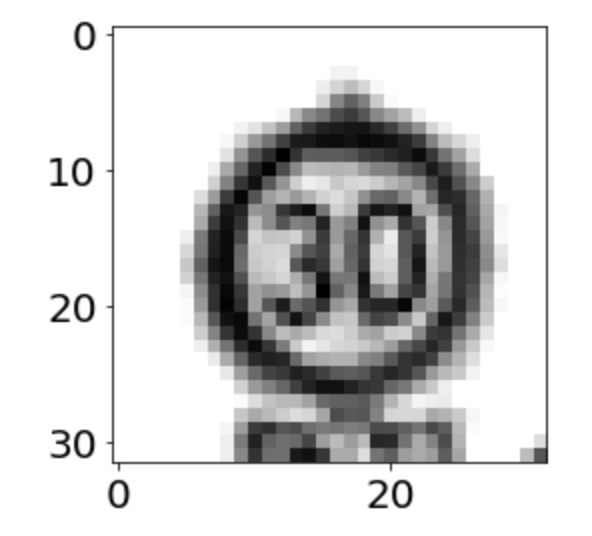
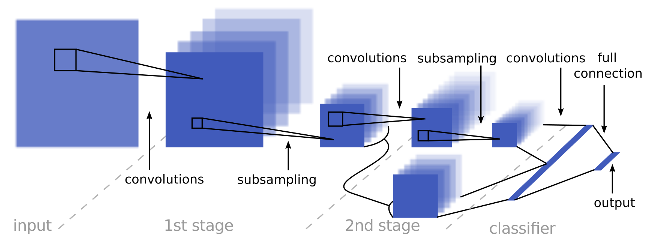
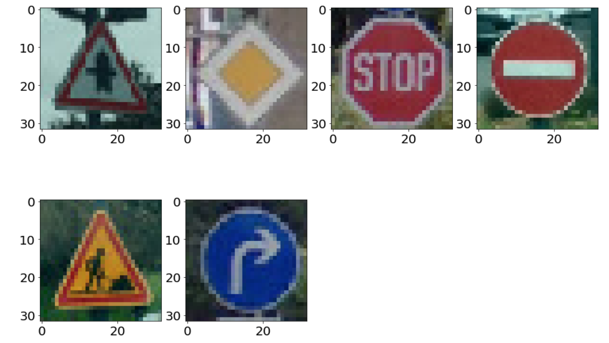
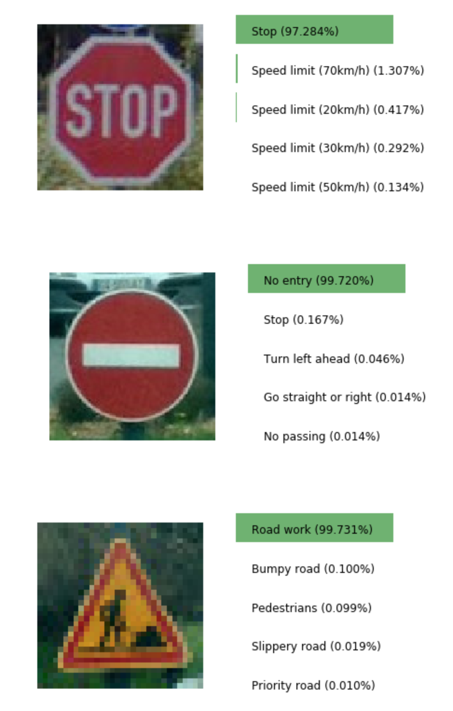
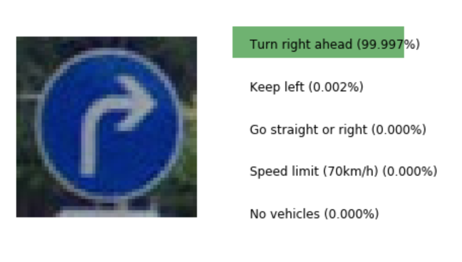
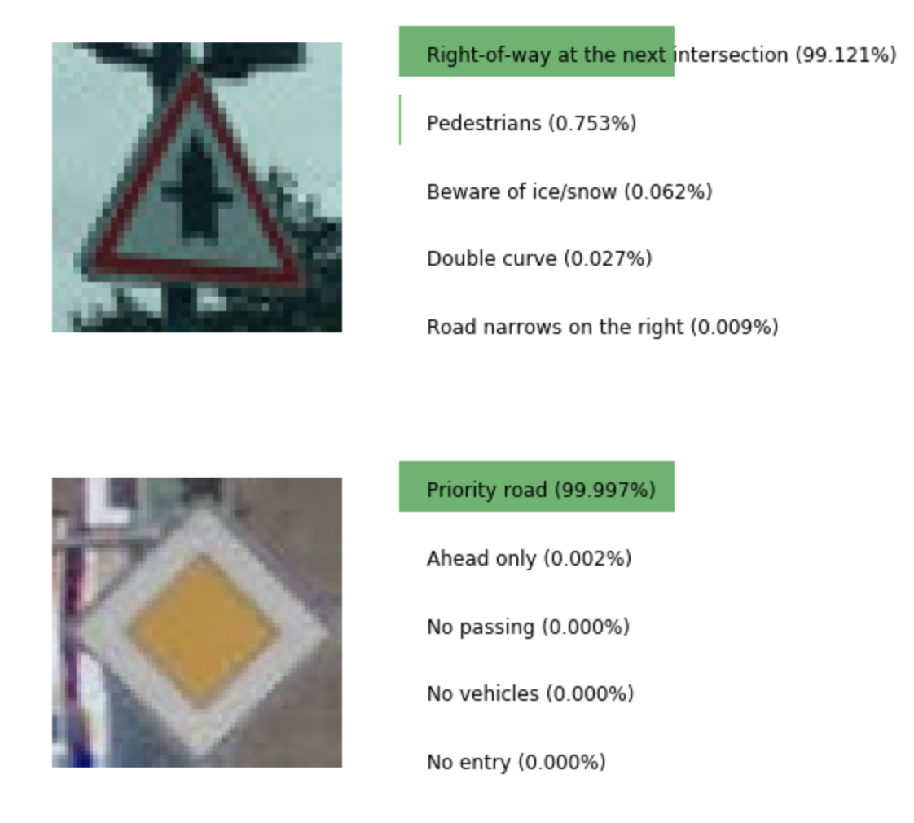

# Traffic Sign Recognition 

## Introduction

In this project, I developed a model using a Convolutional Neural Network (CNN) to classify traffic signs. The model was trained and validated using images from the [German Traffic Sign Dataset](http://benchmark.ini.rub.de/). After the model was trained, it's performance was evaulated on random traffic sign images found on the web.

My final model results are as follows:
* Training set accuracy of 99.90%
* Validation set accuracy of 98.84% 
* Test set accuracy of 97.29%
* New Test set accuracy of 100% (6 new images)

The steps undertaken in this project are as follows:
* Load the data set 
* Explore, summarize and visualize the data set
* Design, train and test a model architecture
* Use the model to make predictions on new images
* Analyze the softmax probabilities of the new images

## Data Set Summary & Exploration

### 1. Basic summary of the data set 

I used the NumPy library to calculate summary statistics of the traffic signs data set:

* The size of original training set is 34799
* The size of the validation set is 4410 
* The size of test set is 12630
* The shape of a traffic sign image is 32x32x3 represented as integer values (0-255) in the RGB color space
* The number of unique classes/labels in the data set is 43

### 2. Exploratory visualization of the dataset

Following the data set summarisation, I performed exploratory visualizations of the data set. This included:

* Plotting an image for each label from the training set. Some of these have been displayed below for convenience.



* Ploting bar charts to see the image distribution across the training & validation sets.


We notice that the distribution in training set *is not balanced*. We have some classes with less than 300 examples and other well represented with more than 1000 examples. A similar story is observed in the validation set distribution as showcased above.

## Design and Test a Model Architecture

### 1. Augmentation

Given the small size of the training set and the uneven distribution of examples for each class label, I decide to generate additional images using Image Augmentation techniques like:
* Central Scaling
* Translation along the horizontal and vertical axes
* Rotation
* Varying lighting conditions, and,
* Motion blurring.

The additional benefit of the augmentation process was that it resulted in an *increase in the diversity* of the data consumed by the model for feature learning.

Following the augmentation process, the size of the training set was 108242.

This phase is **crucial** to improving the performance of the model and also determines how quickily your model converges to a solution. My pre-processing pipeline did the following:

* **RGB color space -> Grayscale**: The images were converted from their original RGB color space to Gray scale. This reduced the the numbers of channels in the input of the network and consequently the amount of memory required to represent these images. My basis for doing this was the observation that the image colors did not impart any additional information that could be leveraged by the network for the classification task.
* **Feature Scaling & Mean Normalisation**: I normalized each image to ensure it had a mean of 0 and standard deviation of 1, and,
* **[Contrast Limited Adaptive Histogram Equalization](https://en.wikipedia.org/wiki/Adaptive_histogram_equalization) (CLAHE)**: I used this algorithm for its ability to amplify local details in areas that are darker or lighter than most of the image. Performing local contrast enhancement on the input images improved the models feature learing ability and consequently its classification accuracy.

Here is the function I used to pre-process each image in the dataset:

```python
def pre_process_image(img):
    '''
    Pre-processes the passed image. The steps include:
    RGB -> Grayscale -> Feature Scaling + Mean Normalisation -> Contrast Limited Adaptive Histogram Equalisation
    :param img: Image, represented as a ndarray of dtype=uint8
    :return Pre-processed image
    '''
    img_p = cv2.cvtColor(img, (cv2.COLOR_BGR2YUV))[:,:,0]
    img_p = (img_p / 255.0).astype(np.float32) # [0-1] interval
    img_p = (exposure.equalize_adapthist(img_p) - 0.5) # [-0.5, +0.5] interval

    return img_p

```

Below is an example of a traffic sign image before and after the processing:



### 3. Final model architecture

 

The architecture of my final model is inspired by the model presented by Pierre Sermanet and Yann LeCun in their [paper](http://yann.lecun.com/exdb/publis/pdf/sermanet-ijcnn-11.pdf). 
My model consisted of 3 CONV layers and 2 FC layers adding up to a total of 5 layers. Moreover, similar to the model presented by Sermanet and LeCun, my model also provides the classifier with different scales of receptive fields/ multi-scale features<sup>*</sup>. This is achieved by branching the output of the 1st CONV layer, performing a second round of subsampling and finally feeding it to the classifier in combination with the output from the 3rd CONV layer.


| Layer                         |     Description                                           |
|:-----------------------------:|:---------------------------------------------------------:|
| Input                         | 32x32 Grayscale image                                     |
| Convolution 5x5               | 1x1 stride, VALID padding, output = 28x28x16              |
| RELU                          |                                                           |
| Max pooling                   | 2x2 filter, 2x2 stride,  output = 14x14x16                |
| Dropout (a)                   | 0.8                                                       |
| Convolution 5x5               | 1x1 stride, VALID padding, output = 10x10x32              |
| RELU                          |                                                           |
| Max pooling                   | 2x2 stride, output = 5x5x32.                              |
| Dropout  (b)                  | 0.8                                                       |
| Convolution 3x3               | 1x1 stride, SAME padding, output = 5x5x32                 |
| RELU                          |                                                           |
| Dropout  (c)                  | 0.8                                                       |
| Fully connected<sup>*</sup>   | max_pool(a) + (b) flattened. input = 1584. Output = 320   |
| RELU                          |                                                           |
| Dropout  (d)                  | 0.8                                                       |
| Fully connected               | Input = 320. Output = n_classes                           |
| Softmax                       |                                                           |

### 4. Model Training
To train the model, I used:
* Heavy data augmentation (details provided above)
* Dropout (with keep probability of 0.8) throughout the network
* Batch size of 128
* Adam Optimiser
* Initial learning rate of 0.001, learning rate was decayed manually by 10 everytime the validation accuracy plateaued
* L2 weight decay (i.e. regularisation) of 0.001, and
* 20 epochs for the training process

### 5. Solution Approach

My final model results were:
* Training set accuracy of 99.90%
* Validation set accuracy of 98.84% 
* Test set accuracy of 97.29%

Below I provide an overview of the steps I undertook to reach to my final model architecture. NOTE: for each attempt I only highlight the model params / architectural changes I made in response to the preceeding attempt to improve the training and validation accuracy.

#### Attempt 1: validation accuracy 93.0%


I started with the baseline LeNet-5 architecture.

* Epochs = 10
* Learning rate = 0.001
* Batch size = 128
* Adam Optimiser

#### Attempt 2: validation accuracy 93.2%

Changes made:
* Epochs = 20
* Learning rate decay of 10 after 10 epochs
* Dropout (with keep probab = 0.8) over C1, C3, C5 and F6

The validation accuracy peaked at ~93% despite all these efforts.


#### Attempt 3: validation accuracy 96.1%

Changes made:
* Increased the size of the training set by augmenting new images. Size of the training set increased by 69% to ~108k images.


#### Attempt 4: validation accuracy ~96%

1st change:
* Increased the filter depth of each CONV layer. C1 (8 -> 16) & C3 (16 -> 32)
* Reduced the # FC layers in the classifier by removing the F6 layer
* Increased the size of C5 (120 -> 256)

I scrapped the changes made above and alternatively tried the following changes:
* Increased the filter depth of each CONV layer. C1 (16) & C3 (32)
* Increased the size of C5 (120 -> 512) and F6 (84 -> 256)
* Added L2 regularisation of 0.0005 to all weights across the network


#### Attempt 5: validation accuracy 98.1%

Changes made:
* Changed the network to use multi-scale features as suggested in the paper [Traffic Sign Recognition with Multi-Scale Convolutional Networks](https://www.google.fr/url?sa=t&rct=j&q=&esrc=s&source=web&cd=1&cad=rja&uact=8&ved=0ahUKEwi079aWzOjSAhWHJ8AKHUx_ARkQFggdMAA&url=http%3A%2F%2Fyann.lecun.org%2Fexdb%2Fpublis%2Fpsgz%2Fsermanet-ijcnn-11.ps.gz&usg=AFQjCNGTHlNOHKmIxaKYw3_h-VYrsgpCag&sig2=llvR7_9QizK3hkAgkmUKTw) and used only one fully connected layer at the end of the network.

 

* L2 regularisation = 0.001 over all the weights across the network


#### Attempt 6: validation accuracy 98.84%

Changes made:
* Increased filter depth across CONV1 (12 -> 16) & CONV2 (24 -> 32)


## Model Evaluation on new images
In addition to evaluating the performance of my network over the test set, I decided to test how well the network classifies random traffic sign images pulled from the web.

The following images were used:
<br />
 

and the result were as follows:
<br />
 
<br/>
 
<br/>
 

As showcased above the prediction accuracy was 100%! 

**Happy days!**

## Future work

In order to *improve the performance* of my model I would perform the following:
* Evaluate the performance of the network on a bigger and more diverse production data set
* Leverage model ensembles
* Do a more detailed analysis of model performance by looking at predictions in more detail. For example, calculate the precision and recall for each traffic sign type from the test set and then compare performance on the six new images.
* Create a deeper network akin to AlexNet/ZFNet by stacking more conv layers prior to each pooling operation.
* Utilise global average pooling to reduce the number of FC layers in the classifier and therefore the overall number of params across the network
* Alternatively, rather than constructing the network from scratch,  I would like to leverage Transfer Learning by using existing CNN architectures to classify the traffic sign images. In particular, I would like to use ResNet/GoogleNet/VGGNet.
