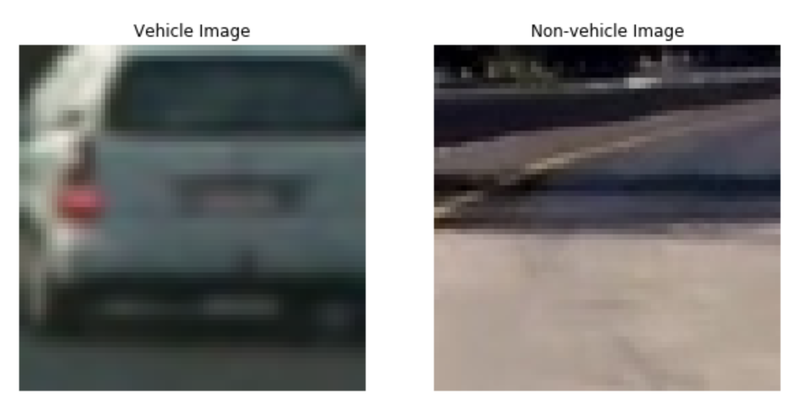
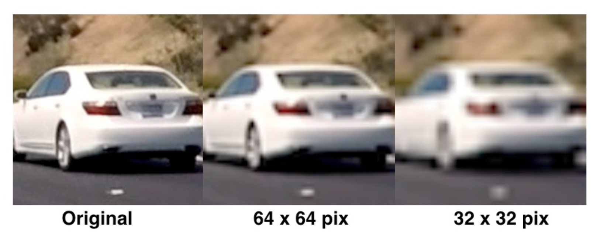
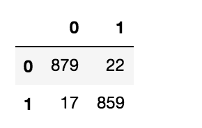
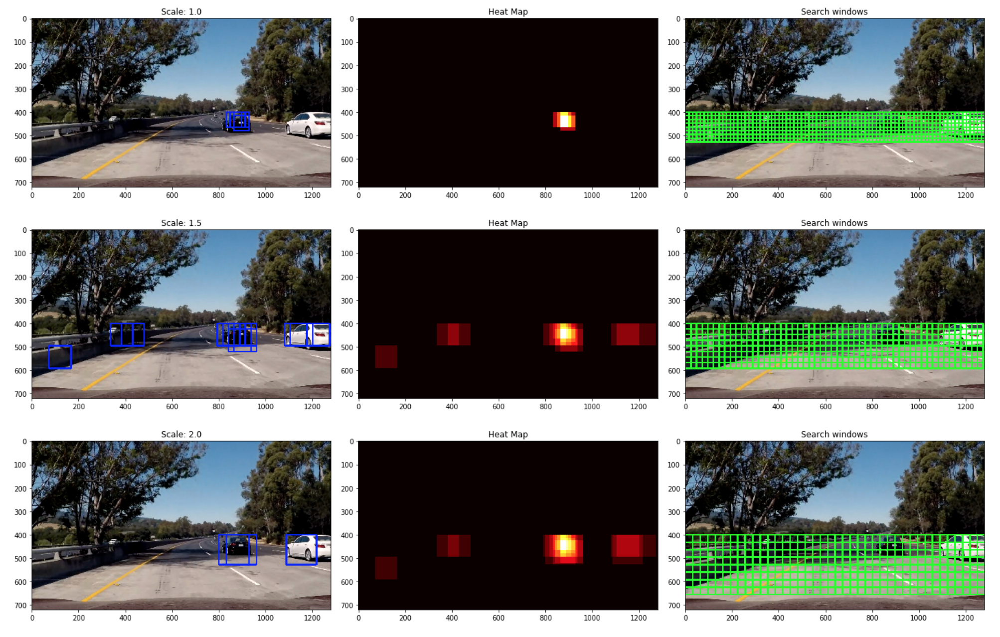
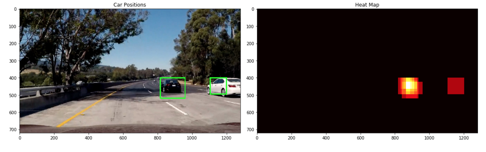

# Vehicle Detection and Tracking

## 1. Project Overview

### 1.1 Goal 

The goal of the project is to create a pipeline to detect and track vehicles in a video. A demo of the pipeline can be found on [Youtube](https://youtu.be/Uvac_LIkh9s)

[](https://www.youtube.com/watch?v=Uvac_LIkh9s)

### 1.2 Dependencies

* Python 3.x
* OpenCV 3.x
* NumPy
* Matplotlib (for visualisations and reading images)
* Scikit-Learn
* Scikit-Image
* MoviePy (to process video files)
* Pickle

### 1.3 Project structure

* **rawdata_exploration.ipynb**: Jupyter notebook that performs an initial round of the data set exploratory visualisation and summarisation. Furthermore, this notebook also splits the dataset into the training and test set while taking into account the *time series issues* (i.e. multiple consecutive frames)  
* **build_classifier.ipynb**: Jupyter notebook that performs feature extraction, feature normalisation and trains a Linear SVC to classify vehicles in an image
* **detection_and_tracking.ipynb**: Notebook that creates a pipeline to detect & track vehicles in a video
* **readme_images/**: Folder to store images used within this README.md
* **test_images/**: Folder containing a set of images for test purposes
* **rawdata.p**: Pickle file containing the processed raw data set of image paths
* **classifier_data.p**: Pickle file containing the trained Linear SVC and parameters associated with feature extraction
* **project_video.mp4**: Video over which to test the pipeline
* **project_video_output.mp4**: Resulting output on passing the *project_video* through the pipeline

## 2. Pipeline

The various steps invovled in the pipeline are as follows, each of these has also been discussed in more detail in the sub sections below:

* Perform feature extraction on a labeled training set of images and train a **Linear SVM classifier**. The feature vector consists of: 
  * **Histogram of Oriented Gradients (HOG)** 
  * Spatially binned raw color values, and,
  * Histogram of color values
* Implement a sliding-window technique and use the trained classifier to search for vehicles in images
* Create a heat map of recurring detections frame by frame to reject outliers, handle multiple detections and follow detected vehicles
* Estimate a bounding box for vehicles detected


### 2.1 Dataset exploratory visualisation and summarisation

The labelled dataset used for this project can be downloaded here:
* [vehicle](https://s3.amazonaws.com/udacity-sdc/Vehicle_Tracking/vehicles.zip), and, 
* [non-vehicle](https://s3.amazonaws.com/udacity-sdc/Vehicle_Tracking/non-vehicles.zip)

These example images come from a combination of the [GTI vehicle image database](http://www.gti.ssr.upm.es/data/Vehicle_database.html), the [KITTI vision benchmark suite](http://www.cvlibs.net/datasets/kitti/), and examples extracted from the project video itself.

The exploration of the data set revealed the following:

* Total # vehicle images: 8792
* Total # non-vehicle images: 8957
* Image shape: (64, 64, 3)
* Image dtype: float32

An example from each of the classes has been visualised below for the reader.



From above we can conclude that the dataset is fairly balanced as it contains equal proportions of vehicle and non-vehicle images. However, the most important observation was that the dataset contained sequences of images where the target object (vehicles in this case) appears almost identical in a whole series of images. In such a case, performing a randomized train-test split will be subject to overfitting because images in the training set may be nearly identical to images in the test set.

To deal with this **time-series issue**, 90% of the first half of each classes dataset (vehicle and non-vehicle) was reserved for training the classifier and the remainder 10% was sliced away as the test set.

**Note:** since we are training a Linear SVC with only one hyper-parameter *C*, the chance of overfitting was very small and as a result no validation set was created.

### 2.2 Feature Extraction

In order to be able to successfully classify vehicles in an image, a set of useful features were needed over which a classifier could be trained. For this project, the following features were used:

1. **Spatially binned raw color values**: It is known that raw pixel intensity values can be useful in performing classification. However, it can be cumbersome to include three color channels of a full resolution image. Therefore, we perform spatial binning on an image which allows us to retain enough useful information to help find vehicles all the while reducing the number of pixels. <br/> <br />For our purposes, OpenCV's ```cv2.resize()``` API was used to scale down the resolution of an image. An example of this can be visualised below. <br/><br/>


2. **Histogram of color values**: Although the raw color values provide us useful information, to be able to stay robust to changes in object appearance we also included the distribution of color values. This removes our dependence from the object's structure and allows for variations in aspects and orientations to be matched.

3. **Histogram of Oriented Gradients (HOG)**: In addition to the color information, knowledge of the shape of the object was also considered useful in performing classification. As a result, HOG features were appended to the overall feature vector. HOG was chosen due to its robustness to noise over simply including per pixel gradient information. <br/><br/> For this project, scikit-image's ```hog()``` API was used.

### 2.2 Data standardisation

To standardise the data, i.e. to ensure each feature in the feature vector had zero mean and unit variance, scikit-learn's ```StandardScaler()``` was fit to the training set. Following this, both the training and test sets were transformed using this fitted instance of the Standard Scaler.

### 2.3 Classifier

It has been shown that Support Vector Machines (SVM's) work well with HOG features. Therefore, an off the shelf Linear SVC from scikit-learn was used as a starting point. 

For feature extraction during the training phase, different params for each of the three features were tweaked and the resulting test set accuracy was used an indicator to evaluate them.

The parameters and some of their corresponding values that were experimented with included:
* **Color space**: HSV, HLS, YUV, YCrCb
* **Spatial bin size**: 32, 24, 16
* **Number of Histogram bins**: 32, 24
* **Number of orientation bins**: 6, 9, 12
* **Pixels per cell**: 8
* **Cells per block**: 2

The final parameters that were chosen are listed in the table below:

| Parameters  | Values |
| --- | --- |
| Color space | YCrCb  |
| Spatial bin size  | (16, 16)  |
| # histogram bins | 24  |
| # orientation bins | 9  |
| pixels/cell | 8  |
| cells/block | 2  |

Using the above listed parameters, we achieved:
* Training Accuracy of **1.00**, and,
* Test set accuracy of **0.9781**

Additionally, the confusion matrix for this model has been visualised below.



Seeing as we were able to obtain a high test accuracy with such a simplistic model additional classifiers such as Decision Trees, Neural Networks or Model Ensembles weren't considered but are a motivation for future work (see section below for more information regarding this).

### 2.4 Sliding Window technique (HOG Sub-sampling windows search)

After having successfully extracted the features and trained a Linear SVM, a sliding window technique was implemented for searching the vehicles in an image. Given that computing HOG features can be expensive, a more efficient method for doing the sliding windows search was implemented over its naive counterpart. In this method, the HOG features were computed just once for the entire image. Following this, the HOG feature vector was sub-sampled for the different multi-scaled windows. This implementation allowed for:
* A faster search for vehicles across an image/video frame, and,
* The use of multi-scale windows made detecting the target object at different aspects more easier

The original sampling rate wih a scale of 1.0 consisted of a window with 8 cells, and each cell with 8 pixels. Different scales for the sliding window along with different search region sizes for each of these windows were experimented with. At the end, the following were used:

| Window sizes  | Scale | Search Region ```y_start```| Search Region ```y_end```|
| --- | --- | --- | --- |
| 64x64 | 1.0 | 400 | 496 |
| 80x80 | 1.25 | 400 | 528 |
| 96x96 | 1.5 | 400 | 592 |
| 112x112 | 1.75 | 400 | 626 |

### 2.5 Handling multiple detections and false positives

As a next step, a heatmap was generated by combining detections from all the multi-scaled windows. This was then thresholded by criterion to reject false positives. The process of multi-scale window HOG sub-sampling, heatmap generation and thresholding has been visualised below for the reader.




### 2.6 Pipeline

The classifier and along with functions implemented in Sections 2.4-2.5 were combined to create a pipeline that could detect and track vehicles in a video. This pipeline was tested over the ```project_video``` and the following was observed:
* Pipeline was **extremely slow** despite the implementation of the HOG sub-sampling window search. It had a processing speed of ~ **2 fps**
* There was a lot of **jitter** in the estimated bounding boxes for the detections across video frames

To improve the pipeline, the following modifications were made:
* The pipeline performed a whole image HOG sub-sampling window search once every 12 frames, and a reduced window search every 6 frames. The reduced window search only scans around a margin from the previously detected vehicle positions. This increased the processing speed from 2fps to **8fps**!

* The vehicle bounding boxes of recent 12 frames are stored in a Python deque object with a max length of 12. The current bounding boxes are calculated from a thresholded heatmap of accumulated boundary boxes over the recent 12 frames. This not only helped smooth out the drawing of the vehicle bounding boxes but also filtered out the false positives.

## 3. Reflection and Future Work

* The vehicles dataset used for this project was not very extensive and only consisted of images of sedans. This can be extended to include different types of vehicles (such as trucks, motorcycles, etc) for practical usage.

* At present, the feature selection process was done by hand. This proved to be a rather tredious process as it required tweaking many different params. A better method of performing feature selection needs to be investigated. One such approach would be implementing a version Randomised Search / Grid Search akin to that done for model selection.

* The best test set accuracy achieved was 0.9781. Although this sufficed for this project, a much higher accuracy would be needed for practical use. 

* The current pipeline is extremely slow and nowhere close to providing real time processing capabilities. Although the pipeline was sped up by skipping frames and performing a whole image window search only once every 12 frames, it introduced an issue where a new target object can only be detected with a 0.5 sec delay. Hence, providing a trade-off between improved detection ability and processing speed.

* As a result, for future work, I would like to explore the use DL models such YOLO, SSD, etc. to achieve higher accuracy and real time processing ability.
